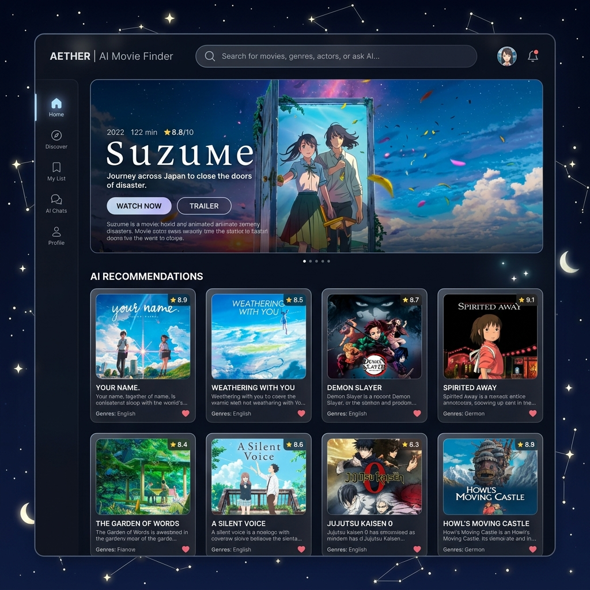

# AI Movie Recommendation System


A full-stack, AI-powered movie recommendation system designed to provide personalized movie suggestions. It leverages modern frontend technologies and a robust Python backend with access to TMDB APIs to fetch rich data (movie posters, cast photos, real-time ratings, etc.) and utilizes ML/AI recommendation engines for high-quality suggestions.

## Features

- **Rich Data Extraction:** Integrated with TMDB API to fetch large datasets including primary movie details, comprehensive cast information, trailers, high-resolution backdrops, and exact "Suzume" style aesthetics (developed based on conversation histories).
- **Advanced Recommendations:** Supports a massive repository of over 1000+ movies per request, ensuring vast pools of relevant selections.
- **Modern User Interface:** A highly polished, responsive front-end experience built in React (with a custom "Suzume" aesthetic), featuring optimized components (e.g., `MovieCard.js`) and stylish transitions.
- **Robust Backend:** Python Flask-based backend, capable of multiple recommendation strategies (Content-based, Collaborative filtering, and Deep Learning mechanisms).

## Tech Stack

### Frontend
- **Framework:** React 19 / `create-react-app`
- **Styling:** Custom CSS (`app.css`) with premium design aesthetics.
- **Icons & Requests:** `lucide-react` for smooth iconography and `axios` for HTTP requests.

### Backend
- **Framework:** Flask (Python) with `flask-cors`
- **Data handling:** `pandas`
- **Machine Learning:** `scikit-learn`
- **External Data Source:** TMDB API via Python's `requests` library.

## Prerequisites

Make sure you have the following installed on your machine:
- Node.js (v14 or higher)
- NPM or Yarn
- Python 3.8+
- TMDB API Key (You'll need this to fetch the movie data)

## Installation

1. **Clone the repository:**
   ```bash
   git clone <your-repository-url>
   cd Ai-movie-recommendation-system
   ```

2. **Setup the Backend:**
   Navigate to the backend directory, create a virtual environment, and install the dependencies.
   ```bash
   cd ai-movie-recommender/backend
   python -m venv venv
   source venv/bin/activate  # On Windows use: venv\Scripts\activate
   pip install -r requirements.txt
   ```
   *Note: Ensure to add your TMDB API Key in the backend environment/configuration if required by `tmdb.py`.*

3. **Setup the Frontend:**
   Navigate to the frontend directory and install dependencies.
   ```bash
   cd ../../frontend
   npm install
   ```

## Usage

1. **Start the Backend Server:**
   ```bash
   cd ai-movie-recommender/backend
   source venv/bin/activate  # On Windows use: venv\Scripts\activate
   python app.py
   ```
   The Flask server will start generally on `http://localhost:5000` or `http://0.0.0.0:5000`.

2. **Start the Frontend Application:**
   ```bash
   cd frontend
   npm start
   ```
   This will spin up the React development server on `http://localhost:3000`.

3. **Explore the App:**
   Open your browser to the local frontend address, search for a movie, and discover rich, AI-generated recommendations.

## Project Structure

```text
Ai-movie-recommendation-system/
├── ai-movie-recommender/
│   └── backend/
│       ├── app.py                # Main Flask application entry point
│       ├── recommender.py        # Core recommendation logic
│       ├── collaborative.py      # Collaborative filtering models
│       ├── deep_learning.py      # Deep learning extensions
│       ├── tmdb.py               # TMDB API Integration & rich data fetching
│       ├── tmdb_5000_credits.csv # Local primary dataset
│       └── requirements.txt      # Python dependencies
└── frontend/
    ├── package.json              # React project metadata
    ├── public/                   # Static files
    └── src/
        ├── components/           # UI Components (e.g., MovieCard.js)
        ├── app.css               # Main styling rules
        └── index.js              # React entry point
```

## Future Scope

- **Expand Deep Learning Models:** Moving from `scikit-learn` base prototypes to advanced `TensorFlow` or `PyTorch` recommender nodes.
- **User Authentication:** Save user profiles and past searches for continuous long-term personalized recommendations.
- **Production Deployment:** Containerize everything via Docker and deploy on scalable platforms like AWS or Vercel/Render.

## License

This project is licensed under the ISC License (as noted in the frontend setup).
